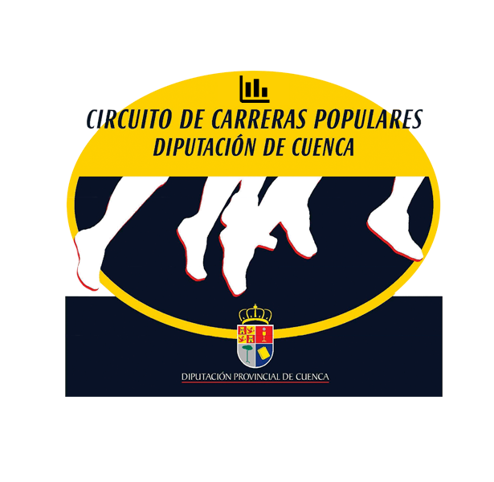

# Running Races Insights

[](https://app.netlify.com/sites/circuitocarrerasdiputacioncuenca/deploys)



Live website available [here](https://circuitocarrerasdiputacioncuenca.netlify.app). Blog post available [here](https://franloza.medium.com/how-to-create-a-data-web-app-for-free-with-evidence-c67ebaf91909).

## Using Codespaces

If you are using this template in Codespaces, click the `Start Evidence` button in the bottom status bar. This will install dependencies and open a preview of your project in your browser - you should get a popup prompting you to open in browser.

Or you can use the following commands to get started:

```bash
npm install
npm run sources
npm run dev -- --host 0.0.0.0
```

See [the CLI docs](https://docs.evidence.dev/cli/) for more command information.

**Note:** Codespaces is much faster on the Desktop app. After the Codespace has booted, select the hamburger menu → Open in VS Code Desktop.

## Get Started from VS Code

The easiest way to get started is using the [VS Code Extension](https://marketplace.visualstudio.com/items?itemName=evidence-dev.evidence):

1. Install the extension from the VS Code Marketplace
2. Open the Command Palette (Ctrl/Cmd + Shift + P) and enter `Evidence: New Evidence Project`
3. Click `Start Evidence` in the bottom status bar

## Get Started using the CLI

```bash
npx degit evidence-dev/template my-project
cd my-project 
npm install 
npm run sources
npm run dev 
```

Check out the docs for [alternative install methods](https://docs.evidence.dev/getting-started/install-evidence) including Docker, Github Codespaces, and alongside dbt.

## Learning More

- [Docs](https://docs.evidence.dev/)
- [Github](https://github.com/evidence-dev/evidence)
- [Slack Community](https://slack.evidence.dev/)
- [Evidence Home Page](https://www.evidence.dev)

## Manual Data Update Process

The following steps were previously performed manually to update the race data. This process is now largely automated by a GitHub Action that runs the `scripts/intelligent_race_updater.py` script.

1.  **Activate Virtual Environment:**
    *   Ensure the Python virtual environment (created using dependencies in `elt/requirements.txt`) is active.
    *   Example: `source .venv/bin/activate` (or your specific venv activation command).

2.  **Update Raw Data and Base DuckDB:**
    *   Run the ELT (Extract, Load, Transform) scripts to fetch the latest race results and build the initial DuckDB database.
    *   Command: `python elt/extract.py && python elt/transform.py`
    *   Alternatively, using the Makefile: `make elt`

3.  **Identify New Races & Update `circuit_races.csv`:**
    *   Query the `race_results.parquet` file (located in `data/raw/`) to find races from the current year that have occurred but whose names are not yet filled in `data/circuit_races.csv`.
    *   Manually (or with the help of a script/LLM) match these new race events to the corresponding placeholder rows in `data/circuit_races.csv` (where `race_name` is empty but `race_location`, `race_slug`, etc., are pre-filled for the year's schedule).
    *   Update the empty `race_name` field in `data/circuit_races.csv` with the official race name for each matched placeholder.

4.  **Update DuckDB Database with Enriched CSV:**
    *   After `data/circuit_races.csv` has been updated with the new race names, re-run the transformation script to ensure the main DuckDB database (`sources/race_results/race_results.duckdb`) reflects these additions and is correctly joined.
    *   Command: `python elt/transform.py`
    *   (If using `make elt` in step 2, and step 3 was manual, you'd re-run this transform part separately or ensure the main update script handles it).

**Automation via `scripts/intelligent_race_updater.py` and GitHub Actions:**

*   The `scripts/intelligent_race_updater.py` script (which can be run via `make update`) now automates steps 2, 3, and 4.
    *   It calls the ELT scripts (`extract.py` and `transform.py`).
    *   It identifies placeholder races in `circuit_races.csv`.
    *   It queries an LLM (via OpenRouter API) to find the best matching official race name for each placeholder from the races found in `race_results.parquet`.
    *   It updates `circuit_races.csv` with these names.
*   The GitHub Action (`.github/workflows/update_data.yml`) orchestrates this process:
    *   Runs `scripts/intelligent_race_updater.py` on a schedule or manually.
    *   If changes are made by the script, it re-runs `elt/transform.py` to ensure the DuckDB is up-to-date with the AI-filled CSV.
    *   It then commits the changes to a new branch and creates a Pull Request.
